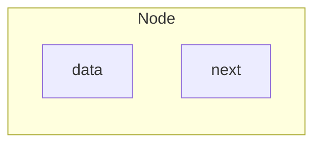
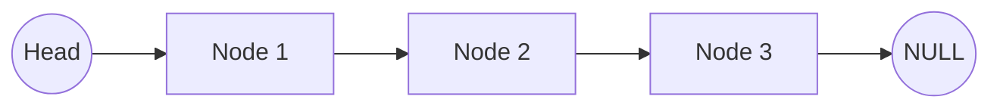

# Linked List

The components of a **linked list**, a type of ==linear data structure, are connected by pointers rather than kept in one continuous area==. A linked list is made up of a number of connected nodes, each of which has data and the address of the node after it.

## Example Diagram





**Node Structure:** A linked list's nodes normally consist of two parts:

1. **Data:** It contains the real value or information related to the node.
2. **Next Pointer or Reference:** It holds the reference (memory address) of the node that comes after it in the sequence.

**Head and Tail:** The head node, which connects to the list's first node, is the point of access to the linked list. The list's end is indicated by the final node, which links to NULL or `nullptr`. We refer to this node as the tail node.

### Traversal

Linked list traversal is an essential operation in working with linked lists, where you ==visit each node in the list to perform some action== (like searching, inserting, or deleting nodes).

1. **Pointer to pointer to node:**

	A pointer to a pointer to a node `Node**` is a technique used to manipulate linked lists, particularly when dealing with operations like inserting or deleting nodes.

	Normally, a pointer to a node `Node*` directly refers to a specific node in the list. However, a pointer to a pointer `Node**` ==allows you to modify the actual pointer that points to a node==. This is particularly useful when you need to change the head of the list or when you want to change the next pointer of a node without needing to handle special cases separately.

```c title=example.c
void insertAtHead(Node** headRef, int newData) {
	Node* newNode = (Node*)malloc(sizeof(Node));
	newNode->data = newData;
	newNode->next = (*headRef);

	*headRef = newNode;
}
```

2. **Look ahead technique:**

	The look-ahead technique is ==used to access or modify the next node in the list while still processing the current node==. This is useful when you need to make decisions based on the next node's data or structure.

	As you traverse the list, you keep an eye on the node following the current node. This allows you to make changes or decisions based on the properties of the next node.

```c title=example.c
void deleteAfter(Node* head, int key) {
	Node* curr = head;

	while (curr != NULL && curr->next != NULL) {
		if (curr->data == key) {
			Node* temp = curr->next;
			curr->next = temp->next;
			free(temp);

			break;
	    }

		curr = curr->next;
	}
}
```

3. **trailing pointers:**

	Trailing pointers involve using two pointers as you traverse the linked list. ==One pointer `curr` is used to reference the current node, and the other `prev` trails behind==, pointing to the previous node. This technique is particularly useful for operations like deletion or insertion after a specific node.

	The `prev` pointer follows the `curr` pointer through the list, always pointing to the node before the current one. This allows you to easily modify the list by updating the `next` pointer of the `prev` node.

```c title=example.c
void deleteNode(Node** headRef, int key) {
    Node* curr = *headRef;
    Node* prev = NULL;

    while (curr != NULL && curr->data != key) {
        prev = curr;
        curr = curr->next;
    }

	if (curr != NULL) {
		if (prev == NULL) {
	        *headRef = curr->next;
	    } else {
	        prev->next = curr->next;
	    }

	    free(curr);
	}
}
```

### Traversal Problem

Create a function to insert a new element at the end of a linked list. The function should handle the case where the element does not yet exist.

**Function Header**

```c title=**insertLast**.h
void insertLast(List*, int)
```

**Declaration**

```c title=insertLast.c
void insertLast(List* L, int x) {
	if (L != NULL) {
		while (*L != NULL && (*L)->data != x) L = &((*L)->next);

		if (*L == NULL) {
			nodetype* newNode = (nodetype*)malloc(sizeof(nodetype));

			if (newNode != NULL) {
				newNode->data = x;
				newNode->next = NULL;

				*L = newNode;
			}
		}
	}
}
```

**Use The Function**

```c title=main.c
#include <stdio.h>
#include <stdlib.h>

typedef struct node {
	int data;
	struct node *next;
} nodetype, *List;

void printList(List);

// Function Header
void insertLast(List*, int);

int main(void) {
	// Populate the list and define the element
	nodetype a = { data: 3, next: NULL };
	nodetype b = { data: 7, next: &a };
	nodetype c = { data: 1, next: &b };
	
	List L = &c;
	int elem = 2;
	
	printList(L);
	// Output: 1 7 3
	
	// Call the insertLast function
	insertLast(&L, elem);
	
	printList(L);
	// Output: 1 7 3 2
}

void printList(List L) {
	while (L != NULL) {
		printf("%d ", L->data);
		L = L->next;
	}
	
	printf("\n");
}

// * Function Definition
void insertLast(List* L, int x) {
	// Prevent NULL pointers
	if (L != NULL) {
		// Traverse through the linked list until it
		// reaches the last node, and the new data
		// must not be in the linked list
		while (*L != NULL && (*L)->data != x) L = &((*L)->next);
		
		// Check if L is the last node
		if (*L == NULL) {
			nodetype* newNode = (nodetype*)malloc(sizeof(nodetype));

			// Check if the allocation was a success
			if (newNode != NULL) {
				newNode->data = x;
				newNode->next = NULL;
				
				*L = newNode;
			}
		}
	}
}
```
