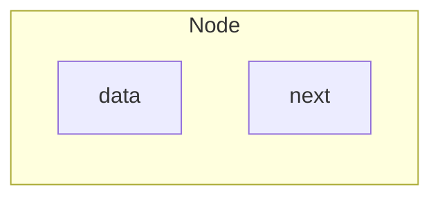
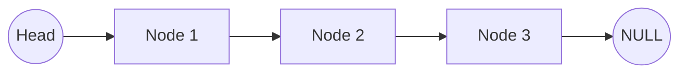

# Linked List

The components of a **linked list**, a type of ==linear data structure, are connected by pointers rather than kept in one continuous area==. A linked list is made up of a number of connected nodes, each of which has data and the address of the node after it.

**Node Structure:** A linked list's nodes normally consist of two parts:

1. **Data:** It contains the real value or information related to the node.
2. **Next Pointer or Reference:** It holds the reference (memory address) of the node that comes after it in the sequence.

**Head and Tail:** The head node, which connects to the list's first node, is the point of access to the linked list. The list's end is indicated by the final node, which links to NULL or `nullptr`. We refer to this node as the tail node.

## References

1. GeeksforGeeks. (2024, July 30). Basic Terminologies of Linked List. GeeksforGeeks. https://www.geeksforgeeks.org/what-is-linked-list/

---

**Date:** 2024 August, 14 06:14 PM 
**Tags:** #DSA 